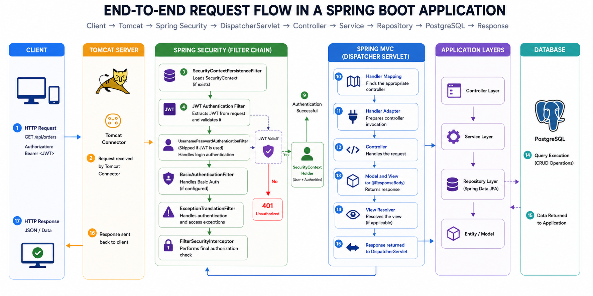
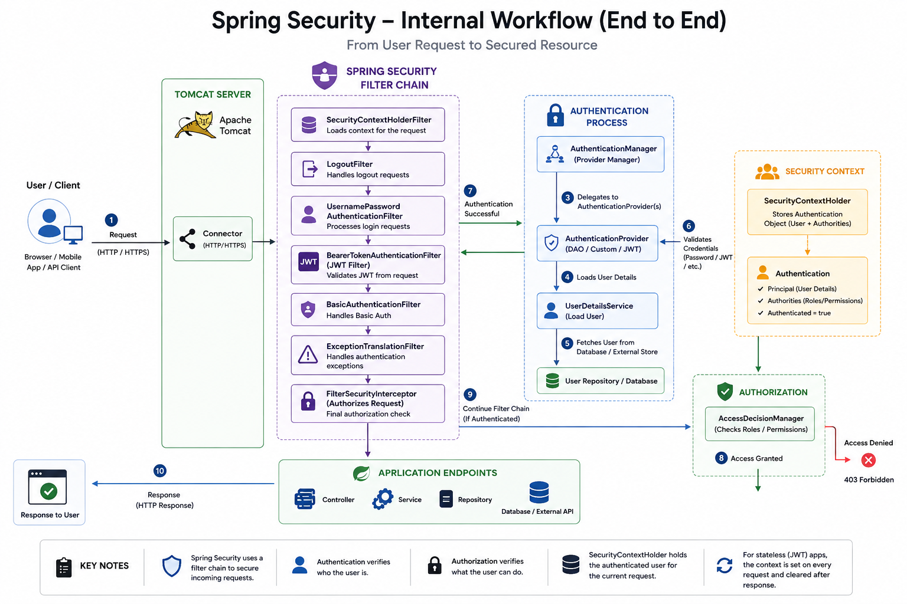
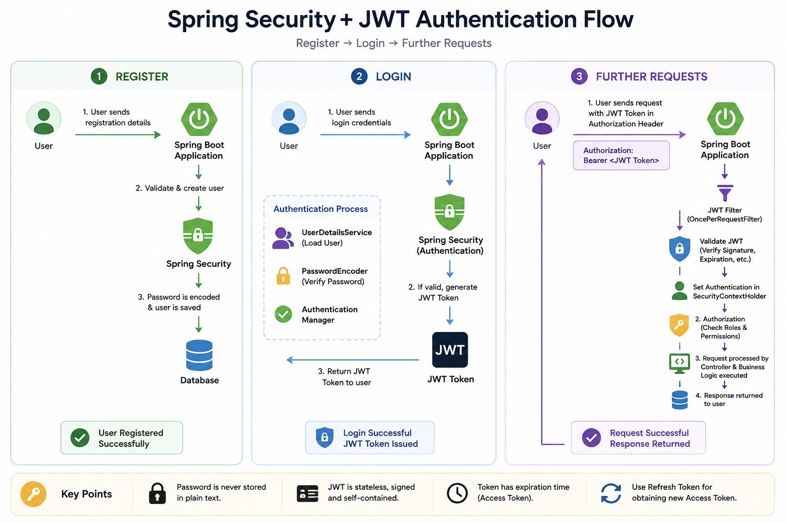
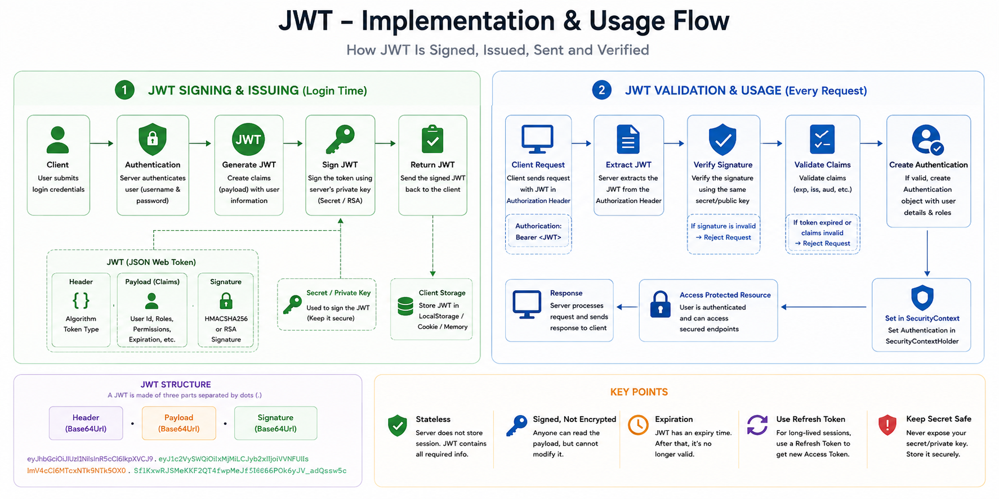
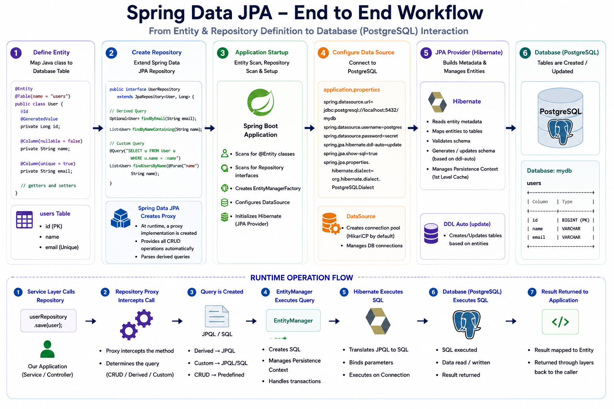
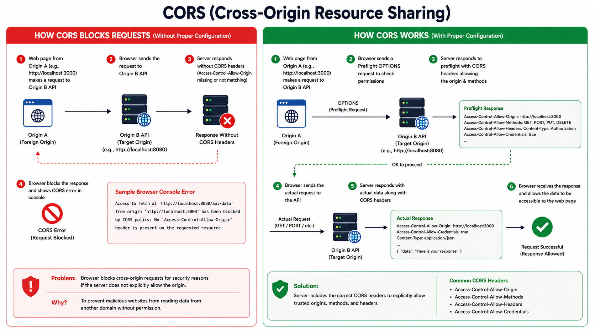
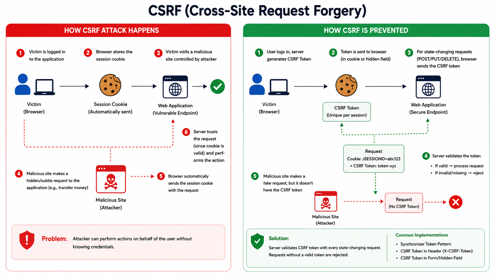
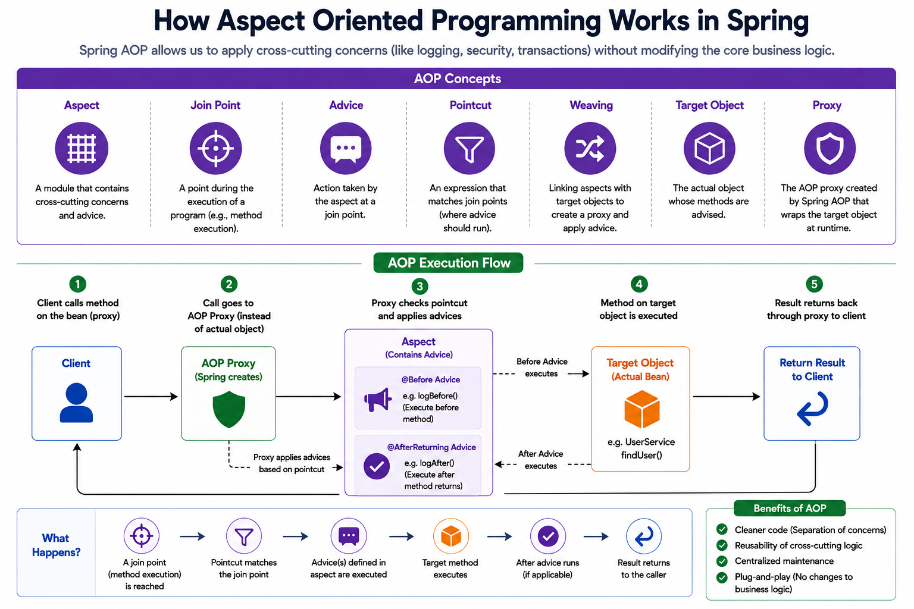

# Hirers — Job Portal Platform

> A production-oriented job portal backend built with Java and Spring Boot, designed to demonstrate clean architecture, secure REST APIs, persistence, file management, and the internal workings of a modern Spring application.

[](https://www.java.com/)
[](https://spring.io/projects/spring-boot)
[](https://spring.io/projects/spring-security)
[](https://spring.io/projects/spring-data-jpa)
[](https://www.mysql.com/)
[](https://maven.apache.org/)
[](https://www.docker.com/)

---

## Overview

**Hirers** is a backend-focused job portal platform that models the core workflows of a real recruitment system.


**Hirers** follows a layered Spring Boot architecture designed to keep HTTP concerns, business logic, persistence, and infrastructure responsibilities separated.

---

## Product Scope

Hirers models the two primary sides of a job marketplace:

### Job Seekers

- Register and authenticate
- Manage their profile
- Upload profile pictures and resumes
- Browse available jobs
- Search and filter jobs
- Apply for jobs
- Track applications
- Bookmark jobs

### Employers

- Register and authenticate
- Manage company information
- Create and manage job postings
- Update job status
- View jobs belonging to their company
- Manage employer-specific resources

### Platform

- Role-based access control
- Secure API endpoints
- Centralized exception handling
- Auditing
- Request logging
- Persistence through Spring Data JPA
- Relational data modelling

---

## Application Workflow

The main application request path is documented through a dedicated end-to-end workflow.



This separation makes it easier to reason about where authentication, validation, business rules, persistence, and response construction belong.

---

## Spring Security Architecture

**Security** is a first-class part of Hirers rather than an isolated authentication utility.


The request enters the Spring Security filter chain before reaching the application's controller layer.




The project documents the internal relationship between:

- Security filters
- Authentication
- AuthenticationManager
- AuthenticationProvider
- UserDetailsService
- PasswordEncoder
- SecurityContext
- Role-based authorization

---

## JWT Authentication

Hirers uses JWT-based authentication for stateless API authentication.



---

## JWT Implementation

The repository also includes a lower-level JWT implementation workflow:



The important security principle is that the token is **signed by the server and verified on every protected request**.

The server does not simply trust the contents of a JWT. The signature must be successfully verified using the configured secret key before the request is considered authenticated.

---

## Persistence with Spring Data JPA

Hirers uses Spring Data JPA and Hibernate for object-relational persistence.



The persistence model follows:

```text
Entity
  ↓
Spring Data Repository
  ↓
Hibernate
  ↓
JPA / SQL
  ↓
MySQL
```

Spring Data JPA removes much of the repetitive repository implementation while still allowing custom JPQL, native SQL, derived queries, transactions, and entity relationships.

The application models relationships such as:

```text
User
 ├── Role
 ├── Profile
 └── Company
       └── Jobs
            └── Applications
```

---

## Security Concepts

The repository contains focused diagrams for important web-security concepts.

### CORS — Cross-Origin Resource Sharing



**CORS** controls which browser origins are permitted to interact with the API.

The documentation covers:

- Origin
- Preflight requests
- Allowed methods
- Allowed headers
- Server-side CORS configuration

---

### CSRF — Cross-Site Request Forgery



The **CSRF** workflow demonstrates:

- How browser credentials can be automatically included with requests
- How a malicious origin can attempt to trigger a state-changing request
- How CSRF protection prevents unauthorized cross-origin actions

For stateless bearer-token APIs, the CSRF threat model differs from traditional session-cookie authentication, which is why the security configuration needs to match the authentication mechanism being used.

---

## Aspect-Oriented Programming

Hirers also documents how Spring AOP works internally.



AOP is used to keep cross-cutting concerns separate from core business logic.

Examples include:

- Request logging
- Performance measurement
- Exception auditing
- Authentication-related auditing

---

## Domain Model

### User Management

The user domain supports:

- Registration
- Login
- Role assignment
- Authentication
- Profile management
- Employer / job-seeker access control

### Company Management

Employers can be associated with companies and manage company-level information.

A company can contain multiple job postings.

### Job Management

The job domain supports:

- Job creation
- Job listing
- Job searching
- Job status management
- Job deletion
- Company-specific job ownership
- Job metadata and compensation information

### Applications

The application domain is responsible for the relationship between job seekers and jobs.

Planned and implemented workflows may include:

- Applying for jobs
- Tracking applications
- Application status
- Application history

### Bookmarks

Job seekers can save jobs for later access.

### Profiles & Resumes

Profiles support:

- Job title
- Location
- Experience level
- Professional biography
- Portfolio website
- Profile picture
- Resume
- File metadata

---

## API Structure

The API is organized around domain resources rather than technical implementation details.

Representative resource groups include:

```text
/api/auth
/api/users
/api/jobs
/api/companies
```

Authentication is handled through bearer tokens:

```http
Authorization: Bearer <JWT>
```

Protected endpoints use the authenticated user's identity and authorities rather than accepting sensitive ownership information directly from the client.

For example, employer job operations resolve the authenticated employer from the security context instead of trusting an arbitrary employer ID supplied by the request.

---

## Cross-Cutting Infrastructure

The application includes infrastructure for concerns that span multiple modules.

### Logging

Application methods and request processing can be monitored through structured application logs and AOP-based logging.

### Auditing

Create/update operations can capture the authenticated user's identity through Spring Data auditing.

```text
Authenticated User
        ↓
SecurityContext
        ↓
AuditorAware
        ↓
createdBy / updatedBy
```

### Exception Handling

A centralized exception-handling layer converts application exceptions into consistent API responses.

Example:

```json
{
  "apiPath": "/api/jobs/employer",
  "errorCode": "500 INTERNAL_SERVER_ERROR",
  "errorMessage": "Employer not found",
  "errorTimestamp": "..."
}
```

---

## Technology Stack

| Layer | Technologies |
|---|---|
| Language | Java |
| Framework | Spring Boot, Spring Framework |
| Web | Spring MVC, Embedded Tomcat |
| Security | Spring Security, JWT |
| Persistence | Spring Data JPA, Hibernate |
| Database | MySQL/PostgreSQL |
| Build | Maven |
| Validation | Jakarta Bean Validation |
| Utilities | Lombok, BeanUtils |
| API Testing | Postman |
| API Documentation | OpenAPI / Swagger |
| Logging | SLF4J / Logback |
| Containerization | Docker, Docker Compose |
| Cloud Direction | AWS |
| Future Infrastructure | RDS, S3, ElastiCache, CloudWatch, SES |

> The repository's current application database is **MySQL**. Older architecture material may reference PostgreSQL; MySQL is the database reflected by the current application configuration.

---

## Development & Testing

The application can be developed and tested locally using:

- IntelliJ IDEA / VS Code
- Maven
- MySQL
- Postman
- Swagger / OpenAPI
- Docker

API testing is organized around the major product domains:

```text
Authentication
    ↓
Users / Profiles
    ↓
Companies
    ↓
Jobs
    ↓
Applications
    ↓
Bookmarks
```

---

## Running Locally

### Prerequisites

Install:

- Java 21+
- Maven
- Git

Optional:

- Docker
- Postman

### Clone the repository

```bash
git clone https://github.com/BenGJ10/Hirers.git
cd Hirers
```

---

### Configure the database

- Using Docker, you can run a MySQL container:    

```bash
docker run --name hirers-mysql -e MYSQL_ROOT_PASSWORD=password -e MYSQL_DATABASE=hirers -p 3307:3306 -d mysql:8.0
```

- Create a MySQL database:

```sql
CREATE DATABASE hirers;
```

- Run the scripts in `src/main/resources/sql` to create the database schema and seed data.


- Configure the application using environment variables or `application.properties`.

---

### Start the application

```bash
./mvnw spring-boot:run
```

Or:

```bash
mvn spring-boot:run
```

The API will be available at:

```text
http://localhost:8080
```

---

## Architecture & Engineering Documentation

The repository includes dedicated visual documentation for:

| Diagram | Purpose |
|---|---|
| `hirers_architecture.png` | Overall system architecture |
| `app_workflow.png` | Application-level workflow |
| `end_to_end_request_flow.png` | Request journey through Spring Boot |
| `spring_security_workflow.png` | Spring Security authentication flow |
| `jwt_authentication.png` | JWT authentication lifecycle |
| `jwt_implementation.png` | JWT signing and verification |
| `spring_jpa.png` | Spring Data JPA and database interaction |
| `cors.png` | Cross-Origin Resource Sharing |
| `csrf.png` | Cross-Site Request Forgery |

These diagrams are intended to make the repository's implementation decisions understandable without requiring the reader to reverse-engineer the entire codebase.

---

## Engineering Focus

Hirers is intentionally built around understanding **why** Spring applications work the way they do.

The project explores:

- How an HTTP request travels through Tomcat and Spring MVC

- How Spring Security intercepts requests

- How JWT authentication is reconstructed on every request

- How authentication reaches the `SecurityContext`

- How authorization decisions are made

- How controllers delegate to services

- How services interact with repositories

- How Spring Data JPA translates repository operations into Hibernate operations

- How Hibernate maps entities to relational tables

- How transactions affect persistence

- How auditing obtains the current authenticated user

- How AOP intercepts method execution

- How CORS and CSRF fit into web security

- How the application can evolve toward a production deployment

---


## Project Philosophy

`Hirers` is built with two goals:

### 1. Build a realistic product

The application models real job-platform workflows rather than isolated Spring Boot examples.

### 2. Understand the framework underneath

The codebase documents the internal flow of Spring Boot, Spring Security, JPA, Hibernate, JWT authentication, AOP, and web-security mechanisms.

The result is intended to be both a **working backend application** and a **technical reference for understanding modern Spring Boot development**.

---

## License

This project is currently maintained as a learning, engineering, and portfolio project.

