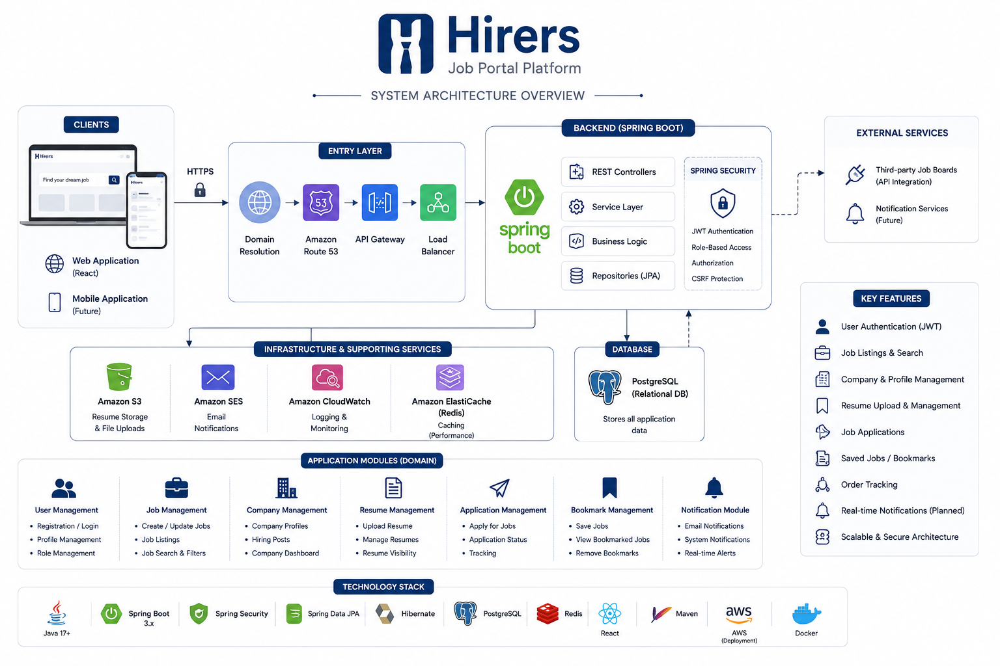

# Hirers - Job Portal

Hirers is a backend-focused job portal application built with **Java and Spring Boot**.

The primary goal of Hirers is not only to build a functional job portal, but also to understand the **internals, design decisions, and production practices behind Spring Boot applications**.

---

## Architecture

The application will evolve toward a layered Spring Boot architecture:

---

## Tech Stack

### Backend

* Java
* Spring Boot
* Spring Framework
* Spring Data JPA
* Hibernate
* Spring Security
* Maven
* Lombok
* Bean Validation
* OpenAPI / Swagger
* Logback
* Micrometer
* OpenTelemetry

### Database

* MySQL
* H2 Database
* Hibernate ORM

### Infrastructure

* Docker
* Docker Compose
* AWS RDS
* AWS Elastic Beanstalk

### Development & Testing

* Git
* Postman
* Swagger / OpenAPI
* Spring Boot DevTools

---

## Core Domain

Hirers will model the major workflows of a job portal.

### Users

* Registration
* Authentication
* Roles
* Profile management

### Jobs

* Job creation
* Job listing
* Job searching
* Job updates
* Job deletion

### Applications

* Applying for jobs
* Application tracking
* Application status

### Bookmarks

* Saving jobs
* Removing saved jobs

### Resumes

* Resume upload
* Resume management
* Resume association with applications

---

## License

This project is currently intended as a learning and portfolio project.

---